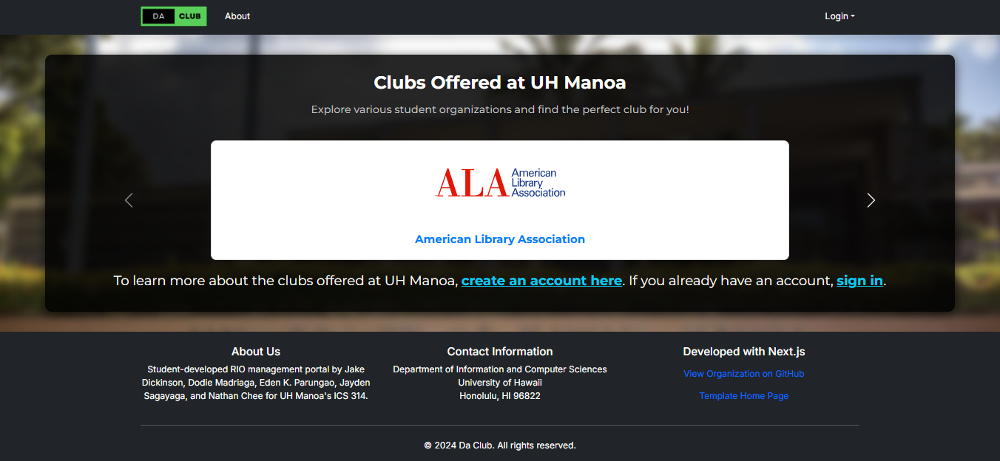
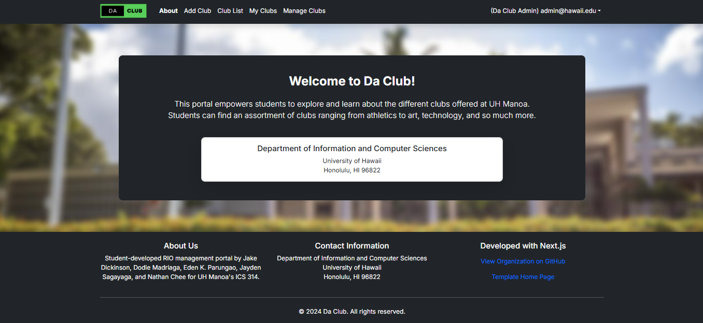
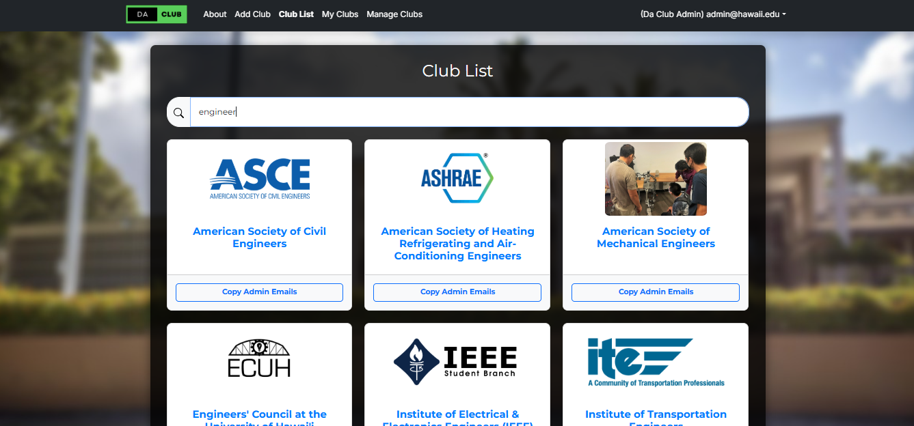

<h1>Project: Da Club</h1>

 
<i>The page above is the landing of our applications for those who haven signed up.</i>

  For our final project for ICS 314, Software Engineering I, as a class we were divided into groups of 5-6 people and each group was tasked with different project prompts. My group was assigned the Project Club Hub. The initial problem was that students who attend UH Manoa have no idea of what clubs were offered there, RIO(Registered Independent Organizations) clubs and even clubs that aren't registered. Even if they knew about the existing clubs, they have no way of finding more information about the club, what they do, where they meet, and many more. Therefore, our project is to address those problems by creating a Club Hub application for students to browse thru a well orgnized directory of all current student clubs whether they have been registered to the RIO or not. Have a brief description of what the club is all about. Have some club information like start date and expiration date, when do they meet, where do they meet, who should they contact, some club photos, and even more. Our Club Hub Application is called Da Club. 

 
<i>The page above is for those who have signed up and logged in.</i>

  Once you have created an account and logged in, you will have access to many features of our app. Features like About, Add Club, List Club, and My Clubs.
  Mange Clubs tab is a feature only for the Admins of the app (meaning the creators of Da Club application).

  You're able to preview the list of Clubs that UH Manoa offers by clicking on the List Club on the Navbar. Once your in the tab, your able to search for clubs by name or by interest areas. If you would like you can register your own Club to the list so that you can let others know of your existing club by clicking on Add Club. You would to provide the information neccesary for a Club. When you add the club your able to edit your own club in the My Club tab.  

<h1>My Contributions</h1>

  As a group we all had different variety of roles to ensure that our application address the problem.
  What I contributioned in the project was both the frontend and backend. I helped implement:
  <ul>
    <li><b>User Features</b>Implemented a page for all the clubs that are offered at UH Manoa</li>
    <li><b>User Interaction Aspects: </b>Aspects including both frontend and backend(Account creation and deletion)</li>
    <li><b>Improvements: </b>Includes filtering out the clubs that have passed their expiration date. If club admin wants to re-list their club, they would have to edit the expiration date.</li>
  </ul>

<h1>
  Take Aways
</h1>

  This experience has really showed me of what it takes to being in a team of developers working together to try address certain problems. 
  It has significantly improved my understanding of collaboration, problem-solving, and the importance of communciation. 

  If you would like to check out Da Club yourself <a href="https://daclub-omega.vercel.app/">Click here</a>. Or if u would like to check out the code <a href="https://github.com/ics-314-code-crew/daclub">Click here</a>.

